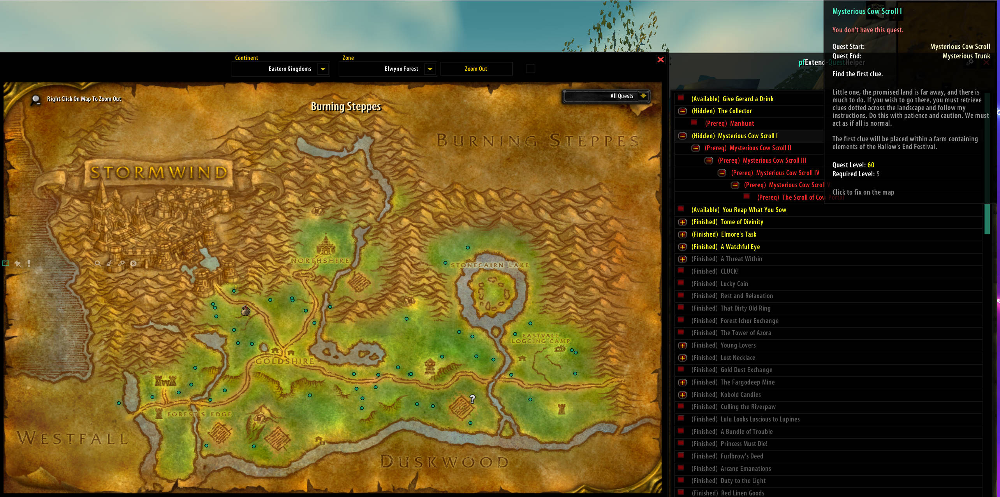
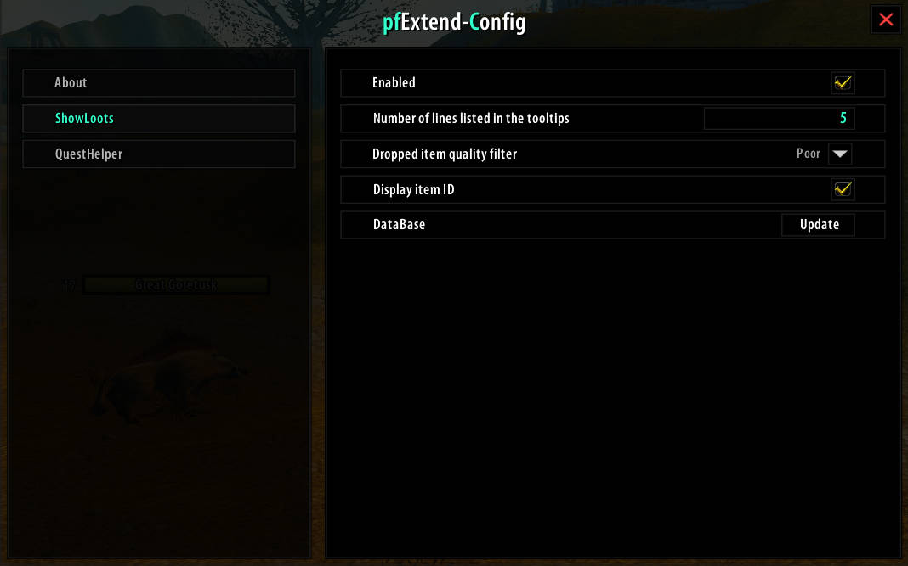

# pfExtend

[English](README.md) | 简体中文

pfExtend 是 [pfQuest](https://github.com/shagu/pfQuest)的扩展插件，提供怪物掉落显示和任务链可视化功能。兼容 **Turtle WoW**（1.12.0 客户端）。

## 功能特性

### ShowLoots - 怪物掉落显示

鼠标悬停在怪物身上时，自动在提示框中显示完整的掉落列表。

**核心功能：**
- **实时掉落预览**：鼠标悬停即可在游戏提示框中查看完整掉落列表
- **掉率可视化**：显示精确掉落百分比，并用颜色标识（绿色=常见，红色=稀有）
- **智能过滤**：按物品品质过滤（粗糙、普通、优秀、精良、史诗、传说）
- **收藏系统**：标记物品为收藏，在掉落列表中高亮显示（收藏物品置顶）
- **详细浏览器**：悬停时按 `Alt+Ctrl` 打开完整掉落浏览器窗口，显示：
  - 带品质颜色的物品链接
  - 精确掉率及颜色标识
  - 物品来源（NPC、物体）
  - 各来源的区域位置
  - 引用掉落表支持（间接掉落）
  - 可点击的物品链接查看详情

**支持的掉落类型：**
- **单位（NPC）掉落**：直接击杀怪物掉落
- **物体掉落**：宝箱、容器、矿点、草药等
- **引用表**：复杂掉落表，链接多个来源（如"世界掉落"表）

**配置选项：**
- 启用/禁用功能
- 设置提示框中显示的最大物品数量
- 按最低物品品质过滤（隐藏垃圾物品）
- 在浏览器中显示物品 ID

---

### QuestHelper - 任务链浏览器

集成在世界地图中的强大任务链可视化工具。

**核心功能：**
- **交互式任务树**：以可展开的树形结构显示当前区域所有可用任务
- **任务链可视化**：自动构建并显示完整任务链（前置任务 → 后续任务）
- **智能任务过滤**：自动按以下条件过滤任务：
  - 种族兼容性
  - 职业要求
  - 专业要求
  - 等级要求
  - 事件任务
  - 前置任务完成状态

**任务状态标识：**

| 颜色 | 标签 | 含义 |
|------|------|------|
| ● 绿色 | 进行中 | 当前在任务日志中 |
| ● 黄色 | 可接取 | 现在可以接取 |
| ● 红色 | 前置 | 缺少前置任务 |
| ● 红色 | 高等级 | 未达到等级要求 |
| ● 灰色 | 已完成 | 已完成（如后续全部完成则变暗） |
| ● 灰色 | 种族/职业/专业 | 不满足要求 |
| ● 蓝色 | 事件 | 节日或事件任务 |
| ● 黄色 | 隐藏 | 从物品掉落开始 |

**地图交互集成：**
- **地图切换按钮**：世界地图上的快速访问按钮（`QH` 按钮）
- **任务标记**：点击任意任务可在世界地图上标记
- **自动地图标记**：显示任务给予者位置（NPC、物体、物品）
- **智能聚类**：将附近的任务标记分组以减少混乱
- **跨区域追踪**：
  - 点击追踪其他区域的任务（自动切换地图）
  - Ctrl+点击查找并追踪各自区域的前置任务

**任务链导航：**
- **可展开树**：点击 `+`/`-` 展开或折叠任务链
- **双击**：一次展开/折叠整个子树
- **自动滚动**：切换区域时自动滚动到相关任务
- **持久标记**：任务标记保持显示直到手动移除

**高级功能：**
- **前置查找器**：当前任务不可用时自动定位前置任务
- **多区域支持**：处理在多个区域或位置可用的任务
- **物品起始任务**：追踪从物品掉落开始的任务（显示掉落来源位置）
- **统一缓存**：优化的数据库，实现快速任务区域查找

---

## 依赖插件

- **[pfQuest](https://github.com/shagu/pfQuest)** - 必需的数据库提供插件
- **[pfQuest-turtle](https://github.com/shagu/pfQuest-turtle)** - Turtle WoW 的额外数据库（仅 Turtle WoW 需要）
- **[pfUI](https://github.com/shagu/pfUI)** - 推荐的 UI 框架（可选）

## 安装方法

1. 下载最新版本 (`pfExtend_X.X.X.zip`)
2. 解压到你的 WoW 插件文件夹：`Interface\AddOns\`
3. 确保文件夹名为 `pfExtend`（不是 `pfExtend_X.X.X`）
4. 重启游戏或重载界面 (`/reload`)

## 命令

| 命令 | 说明 |
|------|------|
| `/pfex` | 打开 pfExtend 配置窗口 |

## 配置

可通过以下方式访问设置：
- 斜杠命令：`/pfex`
- 浏览器窗口的设置按钮（齿轮图标）

## 数据库更新

两个功能都需要一次性数据库初始化：
- 安装后首次登录时自动更新
- 可通过设置手动更新
- pfQuest 数据库变更时需要更新

## 兼容性

- **客户端**：魔兽世界 1.12.0（经典版），兼容 **Turtle WoW**
- **依赖**：pfQuest（Turtle WoW 还需 pfQuest-turtle）、pfUI（可选）
- **冲突**：无已知冲突

## 其它

- **作者**：Cliencer
- **基础框架**：pfQuest by Shagu
- **UI 框架**：pfUI by Shagu
